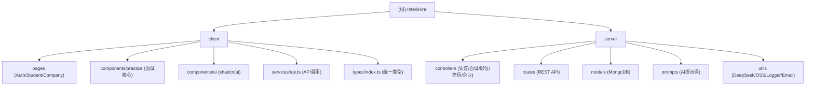

# CLAUDE.md

> IntelliHire 项目全局架构文档

## 项目愿景

IntelliHire 是 AI 驱动的面试练习与招聘平台。学生可通过 AI 模拟面试练习（AI 角色"艾莎"），企业可发布职位并管理候选人。平台前后端分离，独立管理依赖。

## 技术栈概览

| 层级 | 客户端 (client/) | 服务端 (server/) |
|------|-----------------|-----------------|
| 框架 | React 19 + TypeScript 5.8 (strict) | Express 5 (ESM) |
| 构建 | Vite 7 | Node.js |
| UI | Tailwind CSS 4 + shadcn/ui (Radix) | - |
| 状态 | React Query + useFetch hook | - |
| 路由 | React Router 7 | - |
| 数据 | - | Mongoose 8 + MongoDB |
| AI | DeepSeek API (deepseek-chat) | DeepSeek API |
| 存储 | - | 阿里云 OSS |
| 认证 | JWT Bearer Token | JWT + GitHub OAuth |
| 日志 | - | Winston 3 |
| 邮件 | - | Nodemailer (QQ SMTP) |

## 架构总览

### 模块结构图



### 通信方式

- **客户端 -> 服务端**: axios 实例 baseURL = `VITE_API_URL`，JWT Bearer Token 存 localStorage
- **SSE 流式传输**: 面试对话、评估反馈、简历格式化均支持 Server-Sent Events

### API 路由前缀

| 前缀 | 功能 |
|------|------|
| `/api/auth` | 认证（注册/登录/GitHub OAuth） |
| `/api/interview` | 面试（开始/回答/结束，支持 SSE 流式） |
| `/api/jobs` | 职位 CRUD |
| `/api/resume` | 简历上传/解析/流式格式化 |
| `/api/applications` | 申请管理/状态流转/邮件通知 |
| `/api/company` | 企业资料/仪表盘 |
| `/api/upload` | 文件上传（头像/简历/Logo/照片） |

## 核心数据模型

- **User** -- email/password/role(student|company)/githubId，与 Student/Company 共享 `_id`（嵌入式 profile 设计）
- **Student** -- fullName/avatarUrl/skills/education/resumeId
- **Company** -- companyName/companyLogoUrl/industry/companySize
- **Interview** -- chatHistory[]/finalFeedback/result/type/difficulty/rounds/feedbacks[]
- **JobOpening** -- companyId/title/description/skills/rounds[]/status
- **Application** -- jobId/candidateId/resumeId/currentRound/status/history[]/approvedThrough
- **Resume** -- studentId/fileUrl/fileName/fileType/text

## 面试核心流程

1. 学生上传简历 + 配置参数（职位/难度/类型/轮次）
2. DeepSeek AI 生成开场白和第一个问题
3. 学生回答 -> AI 追问（支持普通/流式 SSE）
4. 问答按 3 个一组分块评估（CHUNK_SIZE=6，即 3 对 QA） -> 汇总生成最终反馈和结论
5. Interview 记录存入 MongoDB

### AI 角色

- **艾莎**: AI 面试官角色名，由 `server/src/prompts/system.js` 定义
- AI 提示词: `server/src/prompts/interview.js` (start/respond/conclude 各阶段)

## 模块索引

| 模块 | 路径 | 语言 | 入口 | 职责 |
|------|------|------|------|------|
| client | `client/` | TypeScript | `src/App.tsx` | 前端界面：路由/页面/API调用 |
| server | `server/` | JavaScript (ESM) | `src/index.js` | 后端API：认证/面试/职位/简历/企业管理 |

## 运行与开发

### 客户端

```bash
cd client && npm run dev      # Vite 开发服务器 (5173)
cd client && npm run build    # tsc 编译检查 + vite 构建
cd client && npm run lint     # ESLint 检查
```

### 服务端

```bash
cd server && npm run dev      # nodemon 热重载 (5000)
```

## 测试策略

- 项目当前无测试
- Lint: 客户端 `npm run lint`（ESLint flat config + typescript-eslint）

## 编码规范

- 所有界面文案使用中文
- 客户端 TypeScript strict 模式
- 服务端纯 JS (ESM)，使用 `import/export`
- 暗色主题通过 `.dark` class 切换
- shadcn/ui 组件库不手动修改，通过 shadcn/cli 管理
- 服务端日志使用 Winston logger（Pino 风格 API），不使用 console.log

## AI 使用指引

- AI 服务封装: `server/src/utils/deepseek.js`（普通+流式 DeepSeek API 调用，含指数退避重试机制）
- AI 提示词: `server/src/prompts/system.js`（角色定义）+ `server/src/prompts/interview.js`（面试各阶段提示词）
- 面试评估: 每 5 对 QA 分块评估（`concludeChunk`），最后汇总（`concludeFinal`）
- 多轮面试: 前一轮结束后客户端传入 `isContinuation=true` + `previousFeedback` 触发续轮
- 敷衍检测: AI 回复含 `[REPROMPT]` 标签时要求学生重新回答

## 覆盖率报告

| 维度 | 数据 |
|------|------|
| 估算总文件数 | ~140 (不含 node_modules) |
| 已扫描文件数 | ~138 |
| 覆盖百分比 | ~98.6% |
| 已覆盖模块 | 全部控制器/路由/模型/中间件/工具函数/常量/类型/API服务/核心组件/页面 |
| 剩余缺口 | 无显著缺口 |

## 变更记录 (Changelog)

| 日期 | 描述 |
|------|------|
| 2026-04-24 ~ 04-25 | 初始化并 5 次增量更新，覆盖率从 0 提升至 96.2% |
| 2026-05-24 20:55:26 | 第六次增量更新：发现 13 个新增文件（types/index.ts, services/api.ts, utils/interview.ts, constants/*, MarkdownRenderer, ResumeViewer, SimpleAvatarUploader, useFetch, emailService, logger），更新架构图与文档至 98.6% 覆盖率，生成 .claude/rules/ 规则文件 |
