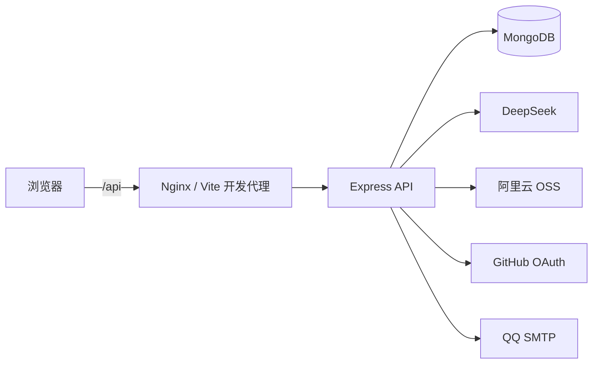
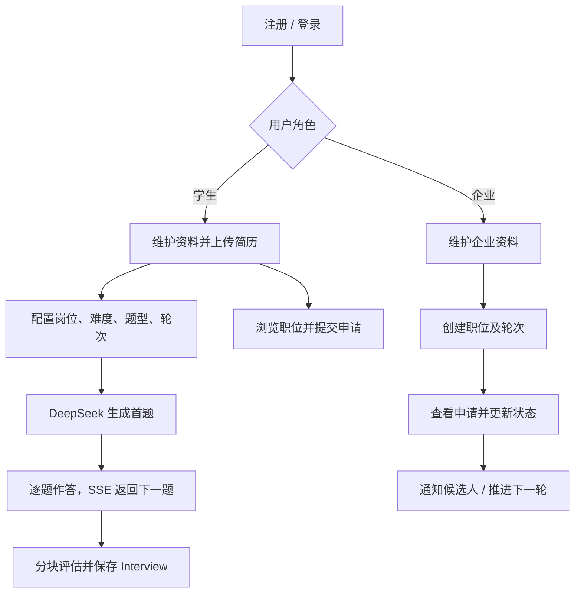

# IntelliHire：AI 智能面试与招聘平台

IntelliHire 是一个面向学生和企业的全栈招聘平台。学生可以维护个人资料与简历、进行 AI 模拟面试、投递职位并追踪流程；企业可以完善企业主页、发布职位、查看候选人并推进招聘状态。

项目采用前后端分离架构：浏览器端使用 React 构建交互界面，服务端使用 Express 提供 REST API，并通过 MongoDB 持久化业务数据。AI 面试问题和评估由 DeepSeek 生成，部分结果通过流式响应返回。

## 功能概览

- 双角色注册、登录与 GitHub OAuth 登录：学生（`student`）和企业（`company`）拥有独立的操作入口。
- 学生侧：个人资料、头像与简历管理、职位浏览与投递、多轮模拟面试、历史面试结果查看。
- 企业侧：企业资料、Logo/企业图片、职位与面试轮次管理、候选人申请查看、招聘状态推进与面试通知邮件。
- AI 能力：基于简历、目标岗位、面试类型、难度和关注主题生成问题；面试结束后按问答块生成反馈与总评。
- 文件能力：简历支持 PDF、DOC、DOCX；图片支持 JPG、JPEG、PNG、WebP。文件存储使用阿里云 OSS。
- 使用体验：浅色/深色主题、浏览器语音识别与语音播报、摄像头预览、SSE 流式展示 AI 输出。

## 技术栈

| 范围 | 技术 |
| --- | --- |
| 前端 | React 19、TypeScript、Vite、React Router 7、Tailwind CSS 4、Radix UI/shadcn-ui、Axios |
| 简历处理 | PDF.js、Mammoth、Tesseract.js（前端扫描型 PDF OCR） |
| 后端 | Node.js、Express 5、Mongoose、JWT、express-validator、Multer、Winston |
| 数据与外部服务 | MongoDB、DeepSeek Chat Completions、阿里云 OSS、GitHub OAuth、QQ SMTP |
| 部署 | Docker Compose、Nginx |

## 架构与核心流程



前端的 Axios 实例固定以同源 `/api` 为基地址，并自动附加本地保存的 Bearer Token。开发环境中 Vite 将 `/api` 转发到 `http://localhost:5000`；Docker 环境中 Nginx 转发到 `server` 服务，并关闭代理缓冲以支持流式面试响应。

### 业务链路



### 服务端分层

- `routes/`：声明 URL、鉴权、限流和校验中间件，再将请求交给控制器。
- `controllers/`：处理 HTTP 参数、权限角色、查询编排和响应；复杂申请创建逻辑抽到 `services/`。
- `models/`：定义 Mongoose 数据模型与常用索引。
- `middlewares/`：提供 JWT 鉴权、请求参数校验、AI 端点限流和统一异常响应。
- `prompts/` 与 `utils/deepseek.js`：构造提示词、调用 DeepSeek，并将上游 SSE 转为应用可消费的流。

### 面试执行与评估逻辑

1. 前端提交岗位、简历、题型与难度到 `POST /api/interview/start-stream`，服务端通过 SSE 请求 DeepSeek 生成首题。
2. 每次作答调用 `POST /api/interview/respond-stream`。服务端依据对话历史生成追问或下一题，并通过 SSE 返回。
3. 结束时调用 `POST /api/interview/conclude-stream`。服务端每 3 组问答拆为一个评估块，再汇总为最终反馈与通过/未通过结果，所有 AI 输出均通过 SSE 返回。
4. 服务端保存 `Interview` 记录；多轮练习会记录当前轮次、总轮次和各轮反馈。

## 项目结构

```text
Interview_Ai/
├── client/                         # React 前端工作区
│   ├── src/
│   │   ├── components/              # 共享组件
│   │   │   ├── practice/            # 模拟面试、简历上传与结果组件
│   │   │   ├── resume/              # 简历展示组件
│   │   │   └── ui/                  # 基础 UI 组件
│   │   ├── pages/
│   │   │   ├── auth/                # 登录、注册
│   │   │   ├── student/             # 学生端页面
│   │   │   └── company/             # 企业端页面
│   │   ├── services/api.ts          # 业务 API 封装
│   │   ├── utils/axiosInstance.ts   # Token 与 401 处理
│   │   ├── contexts/                # 主题上下文
│   │   ├── hooks/、constants/、types/
│   │   ├── App.tsx                  # 路由表
│   │   └── main.tsx                 # 前端入口
│   ├── nginx.conf.template          # 生产环境反向代理模板
│   └── package.json
├── server/                          # Express 服务端工作区
│   ├── src/
│   │   ├── config/                  # MongoDB 连接
│   │   ├── controllers/             # HTTP 控制器
│   │   ├── middlewares/             # 鉴权、校验、限流、错误处理
│   │   ├── models/                  # User、Student、Company 等模型
│   │   ├── prompts/                 # AI 面试与简历提示词
│   │   ├── routes/                  # API 路由
│   │   ├── services/                # 可复用业务服务
│   │   ├── utils/                   # DeepSeek、OSS、邮件、日志工具
│   │   └── index.js                 # 服务入口与健康检查
│   ├── seed-jobs.js                 # 示例职位数据脚本
│   └── package.json
├── docker-compose.yml               # 前端、后端、MongoDB 编排
├── .env.example                     # Docker 环境变量模板
└── README.md
```

### 主要数据模型

| 模型 | 作用 | 关键关联 |
| --- | --- | --- |
| `User` | 登录凭据与角色 | 一对一关联学生或企业资料 |
| `Student` | 学生个人资料、技能、默认简历引用 | `defaultResumeId` → `Resume` |
| `Company` | 企业资料、Logo、相册与招聘信息 | 被 `JobOpening` 引用 |
| `Resume` | 简历库中的一个版本，含文件、文本、状态与归档信息 | `studentId` → `Student` |
| `JobOpening` | 职位、技能、面试轮次和开关状态 | `companyId` → `Company` |
| `Application` | 学生投递、当前轮次、审核进度和历史结果 | 关联职位、学生、简历和面试记录 |
| `Interview` | 对话记录、分段反馈、最终反馈和面试结果 | `student`、`resumeId`；企业面试额外关联申请和职位 |

## 快速开始（Docker，推荐）

### 前置条件

- Docker Desktop（含 Docker Compose v2）
- DeepSeek API Key
- 用于 JWT 签名的高强度随机字符串

### 1. 配置环境变量

在项目根目录复制模板：

```bash
cp .env.example .env
```

至少填写以下配置：

```env
JWT_SECRET=请替换为足够长的随机字符串
DEEPSEEK_API_KEY=请替换为你的密钥
```

默认情况下，Docker 内的后端会连接到 Compose 提供的 MongoDB：

```env
MONGO_URI=mongodb://mongodb:27017/intellihire
CLIENT_PORT=8081
SERVER_PORT=5000
MONGODB_PORT=27017
```

### 2. 启动服务

```bash
docker compose up --build -d
docker compose ps
```

启动完成后：

- 前端：`http://localhost:8081`（或 `CLIENT_PORT` 指定的端口）
- API 健康检查：`http://localhost:5000/health`（或 `SERVER_PORT` 指定的端口）
- MongoDB 调试端口：`127.0.0.1:27017`（仅绑定本机）

常用运维命令：

```bash
docker compose logs -f
docker compose down
```

`docker compose down` 会保留数据库卷；如确实需要删除本地数据库数据，再显式执行 `docker compose down -v`。

## 本地开发

项目包含两个独立工作区，建议使用与锁文件一致的 pnpm。本地 Node.js 请使用 20.19 或更高版本（可执行 `nvm use` 读取 `.nvmrc`）；项目 Docker 镜像使用 Node.js 24。

### 1. 启动 MongoDB 与配置后端

确保本机 MongoDB 可用，然后配置服务端环境变量：

```bash
cp server/.env.example server/.env
```

将 `server/.env` 中的 `MONGO_URI` 保持为本地地址，或改为 MongoDB Atlas 连接串；填写 `JWT_SECRET` 与 `DEEPSEEK_API_KEY`。使用上传功能还必须配置阿里云 OSS。

### 已有数据库迁移：简历库

升级到支持多简历的版本后，在后端目录执行一次以下命令。该命令会把旧的 `Student.resumeId` 复制为 `defaultResumeId`，并补齐已有简历的库管理字段；不会删除旧字段或文件。

```bash
pnpm migrate:resume-library
```

### 2. 分别启动前后端

终端一：

```bash
cd server
pnpm install --frozen-lockfile
pnpm dev
```

终端二：

```bash
cd client
pnpm install --frozen-lockfile
pnpm dev
```

Vite 默认地址为 `http://localhost:5173`，会自动将 `/api` 请求代理到 `http://localhost:5000`。前端不需要、也不应配置 API 地址或任何密钥。

## 环境变量

根目录 `.env` 供 Docker Compose 使用；`server/.env` 用于本地直接启动后端。不要提交任何真实密钥。

| 变量 | 必填 | 说明 |
| --- | --- | --- |
| `JWT_SECRET` | 是 | JWT 签名密钥 |
| `DEEPSEEK_API_KEY` | 是 | DeepSeek API 密钥；仅 AI 面试/简历格式化请求需要 |
| `MONGO_URI` | 是 | MongoDB 连接字符串 |
| `PORT` | 本地后端 | Express 监听端口，默认 `5000` |
| `CLIENT_PORT`、`SERVER_PORT`、`MONGODB_PORT` | 否 | Docker 对宿主机暴露的端口 |
| `DEEPSEEK_TIMEOUT`、`DEEPSEEK_MAX_RETRIES` | 否 | AI 请求超时毫秒数与失败重试次数 |
| `ALIYUN_OSS_REGION`、`ALIYUN_OSS_BUCKET`、`ALIYUN_OSS_ACCESS_KEY_ID`、`ALIYUN_OSS_ACCESS_KEY_SECRET` | 上传时必填 | 阿里云 OSS 文件存储配置 |
| `FRONTEND_URL` | GitHub 登录时必填 | OAuth 回调结束后的前端地址 |
| `GITHUB_CLIENT_ID`、`GITHUB_CLIENT_SECRET` | GitHub 登录时必填 | GitHub OAuth 应用凭据 |
| `GITHUB_TIMEOUT`、`GITHUB_MAX_RETRIES`、`HTTP_PROXY` | 否 | GitHub API 的超时、重试与代理配置 |
| `QQ_SMTP_HOST`、`QQ_SMTP_PORT`、`QQ_SMTP_USER`、`QQ_SMTP_PASS` | 邮件通知时必填 | 企业开启面试流程时的 QQ SMTP 配置 |
| `LOG_LEVEL` | 否 | Winston 最低日志级别，默认 `http` |

## API 概览

除健康检查外，业务接口均以 `/api` 为前缀。登录后服务端会设置 `HttpOnly`、`SameSite=Lax` 的 `access_token` Cookie，浏览器会自动携带；前端不可读取 JWT。服务端暂时兼容 `Authorization: Bearer <token>`，便于渐进迁移。

常规 JSON 成功响应使用 `{ "success": true, ... }`，失败响应使用 `{ "success": false, "error": "..." }`；SSE 端点维持流式协议。参数校验失败统一返回 HTTP `422`。

支持分页的列表接口接受正整数 `page` 与 `pageSize`（默认每页 20，最大 100），并在响应中附带 `{ page, pageSize, total, totalPages }` 形式的 `pagination` 元数据。

### 认证与账户

| 方法 | 路径 | 角色 | 说明 |
| --- | --- | --- | --- |
| POST | `/api/auth/register` | 公开 | 注册学生或企业账户 |
| POST | `/api/auth/login` | 公开 | 登录并设置 HttpOnly Cookie，返回角色与资料 |
| POST | `/api/auth/logout` | 公开 | 清除登录 Cookie |
| GET | `/api/auth/me` | 已登录 | 获取当前用户资料 |
| PUT | `/api/auth/profile` | 已登录 | 更新当前用户允许修改的资料字段 |
| GET | `/api/auth/github` | 公开 | 跳转至 GitHub 授权页 |
| GET | `/api/auth/github/callback` | 公开 | 接收 GitHub 回调并跳转前端 |

### 职位与申请

| 方法 | 路径 | 角色 | 说明 |
| --- | --- | --- | --- |
| POST | `/api/jobs` | 企业 | 创建职位及至少一个面试轮次 |
| GET | `/api/jobs` | 学生 | 查询职位；支持 `company`、`rounds`、`type`、`status`、`page`、`pageSize` 筛选与分页 |
| GET | `/api/jobs/company` | 企业 | 获取当前企业发布的职位；支持 `page`、`pageSize` 分页 |
| GET | `/api/jobs/:jobId` | 学生/企业 | 获取职位详情 |
| PATCH | `/api/jobs/:jobId/status` | 企业 | 将职位切换为 `open` 或 `closed` |
| POST | `/api/applications` | 学生 | 投递职位；同一学生与职位不能重复投递 |
| GET | `/api/applications/mine` | 学生 | 获取我的投递记录；支持 `page`、`pageSize` 分页 |
| GET | `/api/applications/job/:jobId` | 企业 | 获取职位的候选人申请；支持 `page`、`pageSize` 分页 |
| GET | `/api/applications/:applicationId` | 学生/企业 | 获取申请详情 |
| POST | `/api/applications/:applicationId/round` | 学生 | 写入某一轮面试结果 |
| PATCH | `/api/applications/:applicationId` | 企业 | 更新申请状态并在进入面试时异步发送邮件 |

申请状态包括 `applied`、`in-progress`、`selected`、`final-selected` 与 `rejected`。学生轮次成功后可推进至下一轮或录取，失败则标记为拒绝；企业也可以手动更新状态。

### AI 面试与简历

| 方法 | 路径 | 角色 | 说明 |
| --- | --- | --- | --- |
| POST | `/api/interview/start-stream` | 已登录 | SSE 流式生成首题或下一轮首题 |
| POST | `/api/interview/respond-stream` | 已登录 | 流式生成下一题或收尾问题 |
| POST | `/api/interview/conclude-stream` | 已登录 | 流式生成并保存面试评估 |
| GET | `/api/interview/mine` | 已登录 | 获取当前用户的面试记录；支持 `page`、`pageSize` 分页 |
| GET | `/api/interview/:id` | 已登录 | 获取某一面试记录 |
| POST | `/api/resume/format-resume-stream` | 已登录 | 流式格式化简历文本 |
| GET | `/api/resume/:id` | 已登录 | 获取简历元数据 |
| GET | `/api/resume/:id/text` | 已登录 | 读取或提取 PDF/DOC/DOCX 文本 |
| PUT | `/api/resume/:id/text` | 已登录 | 保存编辑后的简历文本 |

上述 AI 端点使用独立限流：同一客户端 15 分钟最多 20 次请求。流式端点需由代理层禁用缓冲。

### 企业资料与文件上传

| 方法 | 路径 | 角色 | 说明 |
| --- | --- | --- | --- |
| GET | `/api/company/dashboard` | 企业 | 获取职位、申请统计及最近申请 |
| GET | `/api/company/profile` | 企业 | 获取企业资料 |
| PUT | `/api/company/profile` | 企业 | 更新企业资料 |
| DELETE | `/api/company/photos` | 企业 | 从企业相册移除指定 URL |
| POST | `/api/upload/avatar` | 已登录 | 上传头像，最大 2 MB |
| POST | `/api/upload/resume` | 学生 | 上传简历，最大 5 MB |
| POST | `/api/upload/logo` | 企业 | 上传企业 Logo，最大 2 MB |
| POST | `/api/upload/photos` | 企业 | 上传企业图片，单次最多 10 张、每张最大 5 MB |

上传图片仅接受 JPG、JPEG、PNG、WebP；简历仅接受 PDF、DOC、DOCX。文件将先进入内存，再上传到 OSS。

## 可用命令与验证

| 工作区 | 命令 | 作用 |
| --- | --- | --- |
| `client/` | `pnpm dev` | 启动 Vite 开发服务器 |
| `client/` | `pnpm lint` | 执行 ESLint |
| `client/` | `pnpm build` | TypeScript 检查并构建生产资源 |
| `client/` | `pnpm preview` | 预览构建结果 |
| `server/` | `pnpm dev` | 通过 Nodemon 启动 Express 服务 |
| 根目录 | `docker compose up --build -d` | 构建并启动完整环境 |

当前仓库未配置自动化测试脚本。变更后建议至少执行：

```bash
cd client && pnpm lint && pnpm build
docker compose config --quiet
```

涉及后端接口时，还应在已配置的 MongoDB 与环境变量下手动验证成功、参数校验失败和未认证三种场景。

## 开发约定

- 前端页面按角色放在 `client/src/pages/student/` 和 `client/src/pages/company/`；跨页面请求统一放入 `client/src/services/api.ts` 或既有 Axios 实例。
- 后端新增写入接口时，应先补充 `server/src/middlewares/validators/` 校验，再在路由层挂载；响应优先使用 `server/src/utils/apiResponse.js`。
- 不要把密钥、MongoDB 连接串或 OSS 凭据提交到仓库。所有浏览器可见的 `VITE_` 变量都不能存放秘密。
- 修改 API 契约时应同步更新服务端校验、前端类型与调用方，并更新本 README。

## 健康检查与排障

- `GET /health`：仅当 Express 进程已启动且 MongoDB 连接状态为 ready 时返回 `200` 与 `{ "status": "ok" }`；否则返回 `503`。
- AI 接口失败时，先检查 `DEEPSEEK_API_KEY`、网络连通性、超时和限流；服务端会对非 4xx 错误按配置重试。
- 上传失败时，检查 OSS 四项配置、Bucket 权限、文件格式和大小限制。
- GitHub 登录回调地址应与 `FRONTEND_URL` 及 GitHub OAuth 应用配置完全一致。
